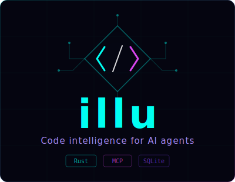

<p align="center">
  
</p>

<p align="center">
  <strong>Give your AI agent a semantic understanding of your Rust codebase.</strong>
</p>

<p align="center">
  <a href="#supported-clients"></a>
  <a href="#supported-clients"></a>
  <a href="https://modelcontextprotocol.io"></a>
</p>

<p align="center">
  <a href="LICENSE"></a>
  
  
</p>

---

**illu** (from *illumination*) is an [MCP](https://modelcontextprotocol.io/) server that gives AI agents deep understanding of Rust codebases. Instead of reading entire files or grepping blindly, your AI gets instant access to symbol definitions, call graphs, impact analysis, and version-pinned dependency docs.

## Setup (2 commands)

```bash
cargo install --path .
illu-rs init .
```

Done. illu indexes your codebase, writes the MCP config, and starts automatically the next time you open **Claude Code** or **Gemini CLI** in the repo.

<details>
<summary>What <code>init</code> does behind the scenes</summary>

1. Parses every `.rs` file with tree-sitter
2. Stores symbols, references, and trait impls in `.illu/index.db` (SQLite)
3. Writes `.mcp.json` (Claude Code) and `.gemini/settings.json` (Gemini CLI)
4. Appends usage instructions to `CLAUDE.md` and `GEMINI.md`
5. Adds `.illu/` to `.gitignore`

On subsequent runs, only changed files are re-indexed (content-hashed, sub-second).

</details>

## Supported Clients

<table>
<tr>
<td width="50%" align="center">

###  Claude Code

Auto-configured via `.mcp.json` and `CLAUDE.md`

Tools: `mcp__illu__query`, `mcp__illu__context`, etc.

</td>
<td width="50%" align="center">

###  Gemini CLI

Auto-configured via `.gemini/settings.json` and `GEMINI.md`

Tools: `@illu query`, `@illu context`, etc.

</td>
</tr>
</table>

Any MCP client that supports stdio transport will work — illu speaks standard MCP.

<details>
<summary>Manual MCP config (if not using <code>init</code>)</summary>

Add to `.mcp.json` (Claude Code) or `.gemini/settings.json` (Gemini CLI):

```json
{
  "mcpServers": {
    "illu": {
      "command": "/path/to/illu-rs",
      "args": ["--repo", "/path/to/your/project", "serve"],
      "env": { "RUST_LOG": "warn" }
    }
  }
}
```

</details>

## Tools

illu provides 6 tools, each designed for a specific AI agent workflow:

### `query` — Find anything in the codebase

Search symbols, docs, or files by name. Full-text search with exact-match priority.

| Parameter | Type | Description |
|-----------|------|-------------|
| `query` | string | Search term |
| `scope` | string? | `symbols`, `docs`, `files`, or `all` (default) |
| `kind` | string? | `function`, `struct`, `enum`, `trait`, `impl`, `const`, `static`, `type_alias`, `macro` |

```
"Config"                              → everything matching Config
"Config", scope: "symbols", kind: "struct"  → just the struct definition
```

### `context` — Get full details for a symbol

Returns everything the AI needs to work with a symbol: signature, doc comments, source body, struct fields/enum variants, trait implementations, callees, and related dependency docs.

| Parameter | Type | Description |
|-----------|------|-------------|
| `symbol_name` | string | Symbol to look up |
| `full_body` | bool? | Return untruncated source (default: false) |

```
"Database"                    → definition, fields, trait impls, callees
"parse_config", full_body: true  → full source even for large functions
```

### `impact` — See what breaks before you change it

Walks the reference graph up to depth 5 to find all transitive dependents. Shows the chain so the AI knows *why* something is affected. In workspaces, also shows affected crates.

| Parameter | Type | Description |
|-----------|------|-------------|
| `symbol_name` | string | Symbol to analyze |

Example output:
```markdown
## Impact Analysis: Config

### Affected Crates
- **core** (defined here)
- **api**
- **cli**

### Depth 1
- **parse_config** (src/lib.rs)

### Depth 2
- **run_server** (src/main.rs) — via parse_config
```

### `docs` — Look up dependency documentation

Get docs for any dependency at the exact version pinned in your `Cargo.lock`. Uses `cargo +nightly doc` (structured JSON) when available, falls back to docs.rs and GitHub READMEs.

| Parameter | Type | Description |
|-----------|------|-------------|
| `dependency` | string | Crate name (e.g. `serde`, `tokio`) |
| `topic` | string? | Filter docs by keyword |

```
"serde"                       → full API summary for serde
"tokio", topic: "runtime"     → only docs mentioning "runtime"
```

<details>
<summary>How dependency docs are fetched</summary>

1. **`cargo +nightly doc`** (preferred) — Runs locally, parses the rustdoc JSON output. Structured, version-accurate, works offline after first build.
2. **docs.rs** — Fetches the HTML page for the exact version, extracts text.
3. **GitHub README** — Discovers repo URL via crates.io API, fetches raw README.

Results are cached in the index database. Subsequent queries are instant.

</details>

### `overview` — Understand project structure at a glance

Lists all public symbols under a path prefix, grouped by file, with signatures and doc comment snippets.

| Parameter | Type | Description |
|-----------|------|-------------|
| `path` | string | File path prefix (e.g. `src/server/`) |

```
"src/server/"    → all public types and functions in the server module
"src/"           → full project API surface
```

### `tree` — See the file layout with symbol counts

Shows the file/module hierarchy with how many public symbols each file exports. Helps the AI orient before diving into code.

| Parameter | Type | Description |
|-----------|------|-------------|
| `path` | string | File path prefix |

```
"src/"           → full module tree
"src/indexer/"   → just the indexer subtree
```

## How It Works

```
            ┌──────────────────────────────────────┐
            │          Your Rust Project            │
            │  src/*.rs  Cargo.toml  Cargo.lock     │
            └─────────────────┬────────────────────┘
                              │
                     ┌────────▼────────┐
                     │   tree-sitter    │  parse ASTs
                     └────────┬────────┘
                              │
          symbols, refs, trait impls, deps, docs
                              │
                     ┌────────▼────────┐
                     │  SQLite + FTS5   │  .illu/index.db
                     └────────┬────────┘
                              │
                     ┌────────▼────────┐
                     │   MCP server     │  stdio
                     └────────┬────────┘
                              │
          ┌───────────────────┼───────────────────┐
          │                   │                    │
    Claude Code         Gemini CLI          Any MCP client
```

## Features

| Feature | Description |
|---------|-------------|
| **2-command setup** | `cargo install` + `illu-rs init .` — works immediately |
| **Incremental indexing** | Content-hashed — only re-parses changed files |
| **Workspace support** | Multi-crate workspaces with inter-crate dependency tracking |
| **Full-text search** | FTS5 prefix matching + trigram substring search |
| **Call graph** | Symbol references with scope-aware local variable filtering |
| **Trait impl tracking** | Maps which types implement which traits |
| **Impact analysis** | Recursive CTE walks references up to depth 5 |
| **Dependency docs** | `cargo doc` JSON (nightly) with docs.rs/GitHub fallback |
| **Full body access** | `full_body: true` reads untruncated source from disk |
| **Dual client support** | Auto-configures Claude Code and Gemini CLI |

## Architecture

```
src/
├── main.rs              # CLI, init, MCP server startup
├── lib.rs               # Shared utilities
├── db.rs                # SQLite (schema, queries, FTS5 + trigram)
├── indexer/
│   ├── mod.rs           # Orchestrator (index, refresh, skill file)
│   ├── parser.rs        # Tree-sitter (symbols, refs, visibility)
│   ├── store.rs         # DB writes
│   ├── dependencies.rs  # Cargo.toml / Cargo.lock parsing
│   ├── workspace.rs     # Workspace detection + member resolution
│   ├── cargo_doc.rs     # Nightly rustdoc JSON parsing
│   └── docs.rs          # Doc fetching (cargo doc → docs.rs → GitHub)
└── server/
    ├── mod.rs           # MCP server (rmcp, tool routing)
    └── tools/           # query, context, impact, docs, overview, tree
```

## Development

```bash
cargo test                                                    # 243 tests
cargo clippy --all-targets --all-features -- -D warnings      # strict lints
cargo fmt --all -- --check                                    # formatting
RUST_LOG=debug cargo run -- --repo /path/to/project serve     # debug mode
```

| Test Suite | Count | Purpose |
|------------|-------|---------|
| Unit | 144 | Parser, DB, indexer, tool handlers |
| Data integrity | 38 | Line numbers, signatures, refs, search correctness |
| Data quality | 42 | End-to-end tool output format and content |
| Integration | 19 | Full pipeline: index, query, verify |

## License

MIT
